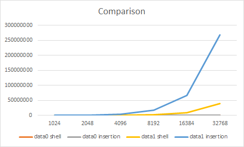
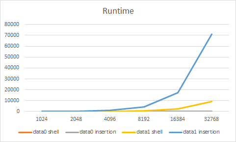
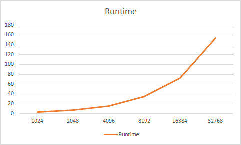
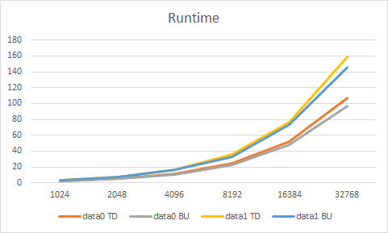
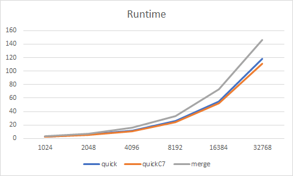
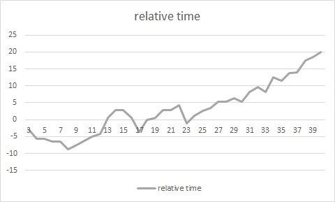

# Homework 2

###### Jin Xu

###### jx217@scarletmail.rutgers.edu

###### ECE, School of  Graduate Studies

###### Rutgers University

## Q1

### Result

Comparisons:

| Compare | Size      | 1024   | 2048    | 4096    | 8192     | 16384    | 32768     |
| ----- | --------- | ------ | ------- | ------- | -------- | -------- | --------- |
| data0   | shell     | 3061   | 6133    | 12277   | 24565    | 49141    | 98293     |
| data0   | insertion | 1023   | 2047    | 4095    | 8191     | 16383    | 32767     |
| data1   | shell     | 46728  | 169042  | 660619  | 2576270  | 9950992  | 39442456  |
| data1   | insertion | 265553 | 1029278 | 4187890 | 16936946 | 66657561 | 267966668 |



Runtime (ms) :

| Time  |   Size    | 1024   | 2048   | 4096    | 8192     | 16384     | 32768     |
| :---: | :-------: | :----- | :----- | :------ | :------- | :-------- | :-------- |
| data0 |   shell   | 0.274  | 0.558  | 1.096   | 2.329    | 4.468     | 9.129     |
| data0 | insertion | 0.094  | 0.196  | 0.414   | 0.808    | 1.525     | 3.276     |
| data1 |   shell   | 10.429 | 39.563 | 154.881 | 609.344  | 2300.576  | 9007.49   |
| data1 | insertion | 63.018 | 243.17 | 989.307 | 3888.903 | 15290.861 | 61916.212 |



### Analysis

- Insertion sort performs better than shell sort when the sequence is in order. The reason is that insertion sort just goes over the sequence for only one time, while the shell sort needs to repeat comparison on the same element when the step **H** is changed.


- In average case, shell sort outplays insertion sort. The reason is shell sort can quickly reduce the numbers of inversions by doing **H-sort**, so there are relatively few inversions when **H** is 1, compared to much more inversions for insertion sort.


## Q2

###  Implementation

I read the idea from  https://en.wikipedia.org/wiki/Kendall_tau_distance.

First, I create a "revert mapping function"  based on ranking a.

```python
map[element]=index for index,element in enumerate(a)
```

Then, I perform this map on another ranking b, to get the "reverted index" of ranking b.

```python
bIndex[index]=map[b[index]] for index in b
```

This **bIndex** is the rearranged index using the map on ranking a, which means we just need to calculate the inversions number of bIndex, and that will be the relative distance from b to a, also known as Kendall Tau distance.

In order to count the inversion numbers in less than $O(N^2)$, the most frequently used method is merge sort. This is because we need a **stable** sorting algorithm(in case missing counting the inversion when doing long distance swap), and the insertion sort is $O(N^2)$, so merge sort is the only choice.

When doing **merge()** operation in merge sort, if a right element is smaller, count **mid-i+1** :

```python
# merge()
for k in range(lo, hi+1):
	if i > mid:
        a[k: hi + 1] = aux[j: hi + 1]
        break
    elif j > hi:
        a[k:hi+1] = aux[i: mid+1]
        break
    elif aux[j] < aux[i]:				# right is smaller
        a[k], j = aux[j], j + 1
        num += mid-i+1					#count elements from i to mid
    else:
        a[k], i = aux[i], i+1
```

### Result

|    Size    | 1024   | 2048    | 4096    | 8192     | 16384    | 32768     |
| :--------: | ------ | ------- | ------- | -------- | -------- | --------- |
| Inversions | 264541 | 1027236 | 4183804 | 16928767 | 66641183 | 267933908 |
| Runtime/ms | 3.461  | 7.731   | 16.009  | 35.064   | 72.925   | 153.886   |



### Analysis

As the result shows this implementation has $O(NlogN)$ time complexity.

## Q3

### Result

Comparison:

| Size  | 1024 | 2048  | 4096  | 8192  | 16384  | 32768  |
| :---: | ---- | ----- | ----- | ----- | ------ | ------ |
| data0 | 5120 | 11264 | 24576 | 53248 | 114688 | 245760 |
| data1 | 8954 | 19934 | 43944 | 96074 | 208695 | 450132 |

Runtime (ms):

| Time  | Size | 1024 | 2048 | 4096  | 8192  | 16384 | 32768  |
| ----- | ---- | ---- | ---- | ----- | ----- | ----- | ------ |
| data0 | TD   | 2.72 | 5.73 | 11.59 | 24.69 | 51.62 | 107.15 |
| data0 | BU   | 2.47 | 5.33 | 10.73 | 22.73 | 47.54 | 97.02  |
| data1 | TD   | 3.56 | 7.88 | 16.68 | 36.26 | 76.51 | 158.88 |
| data1 | BU   | 3.39 | 7.29 | 16.49 | 33.18 | 73.36 | 146.07 |



### Analysis

- The grow rate for comparisons is roughly $O(N)$, this property makes merge sort fast and stable.
- The time complexity is $O(NlogN)$. 
- Bottom-up is slightly faster than Top-down, that is because TD version spent some time on recursion.

## Q4

### Analysis

I choose insertion sort.

Given that this dataset is already in order, the insertion sort would be the fastest one because it only has $N-1$ times data comparison, which means $2(N-1)$ data access and $N-1$ comparison, that is $O(3(N-1))$.

For other sorting algorithms:

- Selection sort is $O(N^2)$
- Shell sort has more data comparison according to  **Q1**
- Merge sort would spend extra time on reading or writing **aux**
- Quick sort would shuffle the original dataset making it slower
- ...

## Q5

### Result

Runtime (ms) :

| Time  |   Size    | 1024 | 2048 | 4096  | 8192  | 16384 | 32768  |
| :---: | :-------: | ---- | ---- | ----- | ----- | ----- | ------ |
| data0 | quickSort | 1.77 | 3.74 | 7.19  | 13.81 | 28.59 | 59.08  |
| data0 | qSortCF7  | 1.21 | 2.67 | 4.71  | 10.12 | 21.5  | 46.21  |
| data1 | quickSort | 2.57 | 5.83 | 11.84 | 25.71 | 55.11 | 118.16 |
| data1 | qSortCF7  | 2.32 | 5.06 | 10.8  | 23.94 | 52.16 | 110.77 |



Cut-off experiment:

I have recorded the runtime on **data1.32768** for cut-off from 3 to 40 and do $T_c-118.16$.

 

### Analysis

- Performance: quick sort with cut-off-7 is the fastest, quick sort is at the median, and merge sort is the slowest.
- There is little different between quick sort with cut-off-7 and quick sort.
- The switching point is 4 and 12. For cut-off in $[4,12]$, quick sort with cut-off is better, for the others, quick sort is better.


## Q6

1. Merge Sort(bottom-up)
2. Quick Sort
3. Knuth Shuffle
4. Merge Sort(top-down)
5. Insertion Sort
6. Heap Sort
7. Selection Sort
8. Quick Sort