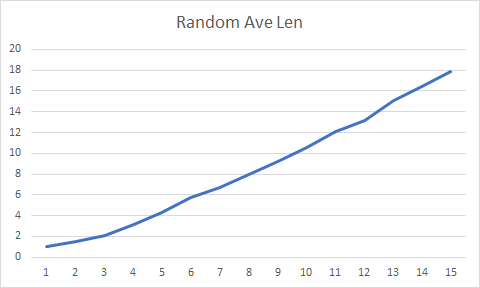
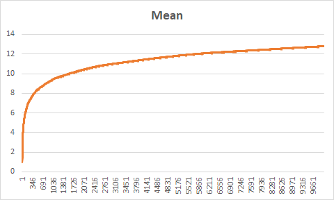
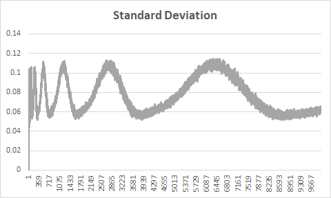

# Homework 3

###### Jin Xu

###### jx217@scarletmail.rutgers.edu

###### ECE, School of Graduate Studies

###### Rutgers University

## Q1

### Implementation

Without balancing, two-three tree is similar to BST, only **put()** needs some changes:

```pseudocode
#at bottom
if Null
	new a Node with red link, which means default 3-nodes
if on the left side
	...
	check for 4-nodes, revert it to 3-nodes
if on the right side
	...
	check for 4-nodes, revert it to 3-nodes
```

I also implemented the ____str____ function, call **print(tree)** to print the in-order key-value pairs sequence.


## Q2

###### Note: For each data is an average of 10 experiments

### Result

|   N   | Random AveLen | Ordered AveLen |
| :---: | :-----------: | :------------: |
|   1   |       1       |       1        |
|   2   |      1.5      |      1.5       |
|   4   |     2.125     |      2.5       |
|   8   |     3.125     |      4.5       |
|  16   |    4.31875    |      8.5       |
|  32   |    5.7375     |      16.5      |
|  64   |   6.715625    |      32.5      |
|  128  |   7.938281    |      64.5      |
|  256  |   9.244922    |     128.5      |
|  512  |   10.54238    |     256.5      |
| 1024  |    12.1249    |     512.5      |
| 2048  |   13.11255    |     1024.5     |
| 4096  |   15.05837    |     2048.5     |
| 8192  |   16.39889    |     4096.5     |
| 16384 |   17.84252    |     8192.5     |



### Analysis

Result shows random insertion is $O(logN)$, and ordered insertion is always $O(N/2)$

## Q3

###### Note: It takes too long to run 100 trials for each on my computer, so the data is actually 10 times average

### Result

|    N    | Red Nodes (%) |
| :-----: | :-----------: |
|  10000  |    25.357     |
| 100000  |    25.388     |
| 1000000 |    25.392     |

### Analysis

Result shows that not matter how great N is, the red nodes is always take a quarter in the tree. 

## Q4

###### Note: It takes too long to run 1000 trials for each on my computer, so the data is actually 5 trials

### Result





### Analysis

- The average path length for red-black tree is $O(logN)$, and it is slightly smaller than simple BST path length (as result from Q2). 
- The standard deviation is flipping between 0.05 to 0.12, that is because as the height of tree is increasing, the length for the leaves are increasing  too, which causes the turning points for standard deviation.

## Q5

### Result

- **select(7)** is 8
- **rand(7)** is 6


