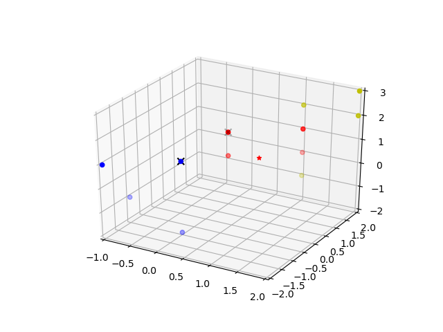
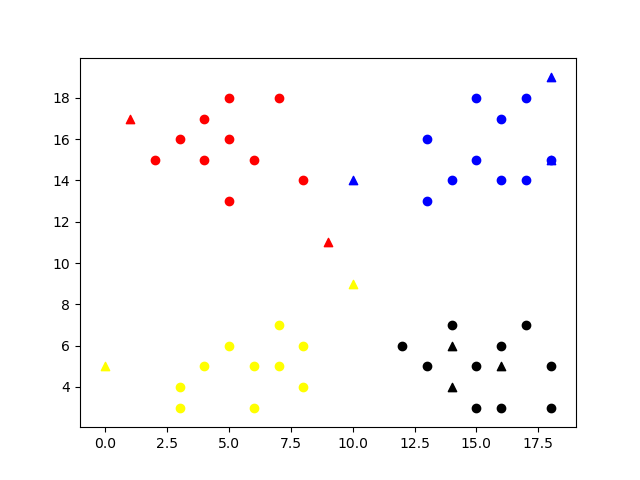

# HW1

###### Jin Xu 

###### jx217

------

## Problem1

#### Implementation

```python
def kNNClassify(newInput, dataSet, labels, k):
    #calculate the distance matrix using L2 distance
    distances = np.sum((dataSet-newInput)**2, axis=1)
    #get the sorted indices and take 0 to k
    nearestKindices = np.argsort(distances)[:k]
    #get the k nearest labels
    nearestKlabels = labels[nearestKindices]
    #count the labels and return the max of them
    return np.argmax(np.bincount(nearestKlabels))
```

I print out the classified label and k nearest neighbors of test data and plot a 3D scatter diagram(the star mark is the test data, X mark are the neighbors).

#### Result

#### K=1

```
k: 1, class: 0
nearest 1 points are 
[[0 1 1]]
```


#### K=2

```
k: 2, class: 0
nearest 2 points are 
[[ 0  1  1]
 [ 0 -1  1]]
```



#### K=3

```
k: 3, class: 0
nearest 3 points are 
[[ 0  1  1]
 [ 0 -1  1]
 [ 0  1  0]]
```


## Problem2

#### Implementation

```python
def kNNClassify(newInput, dataSet, labels, k):
    result = []
    #(x-y)^2 = x^2+y^2-2xy
    newInput_squared = np.sum(newInput ** 2, axis=1)
    dataSet_squared = np.sum(dataSet ** 2, axis=1)
    distances = np.sqrt(newInput_squared[:, None]+dataSet_squared -
                        2*np.dot(newInput, dataSet.T))
    nearestKindices = np.argsort(distances)[:, :k]
    nearestKlabels = labels[nearestKindices]
    for i in range(nearestKlabels.shape[0]):
        result.append(np.argmax(np.bincount(nearestKlabels[i, :])))
    return result
```

#### Result

I choose K = 4

```
random test points are: [[ 9 11]
 [10 14]
 [10  9]
 [14  6]
 [18 15]
 [18 19]
 [ 0  5]
 [16  5]
 [ 1 17]
 [14  4]]
knn classfied labels for test: [0, 1, 2, 3, 1, 1, 2, 3, 0, 3]
```



## Problem3

#### Implementation

```python
# I reshape the image data into 2 dim
# so that I can use the same method as problem 2
x_train = x_train.reshape(60000, 28*28)
x_test = x_test.reshape(10000, 28*28)
def kNNClassify(newInput, dataSet, labels, k):
    result = []
    newInput_squared = np.sum(newInput ** 2, axis=1)
    dataSet_squared = np.sum(dataSet ** 2, axis=1)
    distances = np.sqrt(newInput_squared[:, None]+dataSet_squared -
                        2*np.dot(newInput, dataSet.T))
    nearestKindices = np.argsort(distances)[:, :k]
    nearestKlabels = labels[nearestKindices]
    for i in range(nearestKlabels.shape[0]):
        result.append(np.argmax(np.bincount(nearestKlabels[i, :])))
    return result
```

#### Result

I choose K = 10

```
---classification accuracy for knn on mnist: 0.9665 ---
---execution time: 51.983373165130615 seconds ---
```

