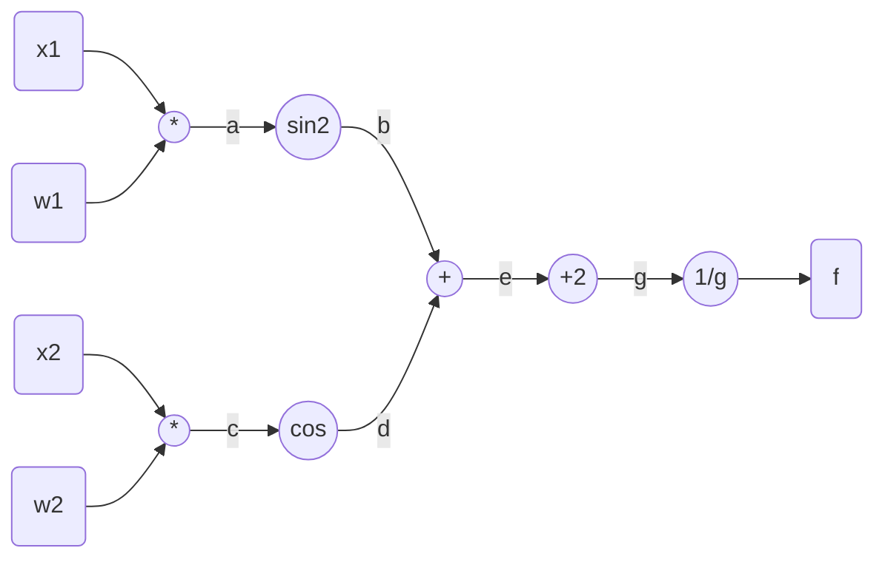

# HomeWork 2

## Q1

Computational graph:

Where we have:
$$
\begin{aligned}
f(g)&=\frac{1}{g}\longrightarrow \frac{{\rm d}f}{{\rm d}g}=\frac{-1}{g^2}\\
g(e)&=e+2\longrightarrow\frac{{\rm d}g}{{\rm d}e}=1\\
e(b,d)&=b+d\longrightarrow\frac{\partial e}{\partial b}=\frac{\partial e}{\partial d}=1\\
b(a)&=sin^2a\longrightarrow\frac{{\rm d}b}{{\rm d}a}=sin2a\\
a(x_1,w_1)&=x_1w_1\longrightarrow\frac{{\rm d}a}{{\rm d}x_1}=w_1,\frac{{\rm d}a}{{\rm d}w_1}=x_1\\
d(c)&=cosc\longrightarrow\frac{{\rm d}d}{{\rm d}c}=-sinc\\
c(x_2,w_2)&=x_2w_2\longrightarrow\frac{{\rm d}c}{{\rm d}x_2}=w_2,\frac{{\rm d}c}{{\rm d}w_2}=x_2\\
\end{aligned}
$$
So that:
$$
\begin{align}
\frac{\partial f}{\partial x_1}&=\frac{-w_1sin(2x_1w_1)}{(2+sin^2(x_1w_1)+cos(x_2w_2))^2}\\
\frac{\partial f}{\partial w_1}&=\frac{-x_1sin(2x_1w_1)}{(2+sin^2(x_1w_1)+cos(x_2w_2))^2}\\
\frac{\partial f}{\partial x_2}&=\frac{w_2sin(x_1w_1)}{(2+sin^2(x_1w_1)+cos(x_2w_2))^2}\\
\frac{\partial f}{\partial w_1}&=\frac{x_sin(2x_1w_1)}{(2+sin^2(x_1w_1)+cos(x_2w_2))^2}\\
\end{align}
$$
