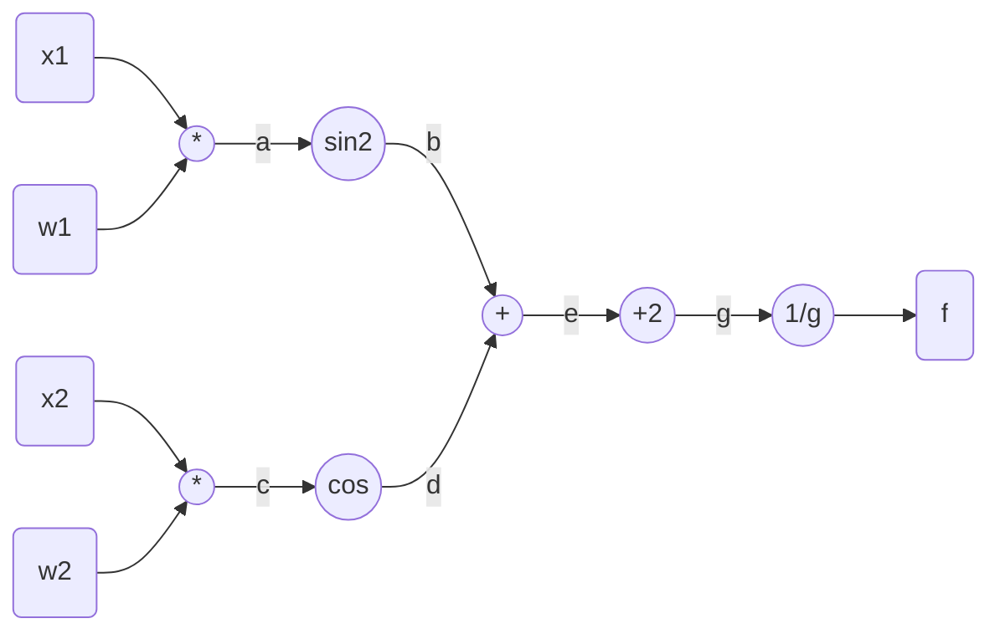
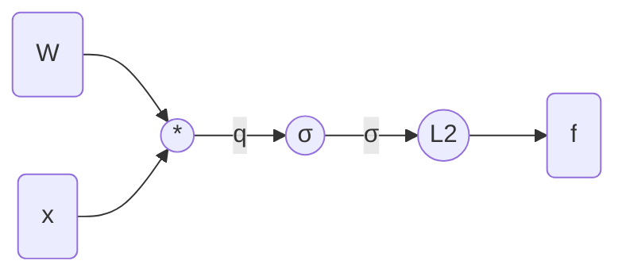

# HomeWork 2

## Q1

### (a)

Computational graph:



Where we have:
$$
\begin{aligned}
f(g)=\frac{1}{g}&\longrightarrow \frac{{\rm d}f}{{\rm d}g}=\frac{-1}{g^2}\\
g(e)=e+2&\longrightarrow\frac{{\rm d}g}{{\rm d}e}=1\\
e(b,d)=b+d&\longrightarrow\frac{\part e}{\part b}=\frac{\part e}{\part d}=1\\
b(a)=sin^2a&\longrightarrow\frac{{\rm d}b}{{\rm d}a}=sin2a\\
a(x_1,w_1)=x_1w_1&\longrightarrow\frac{{\rm d}a}{{\rm d}x_1}=w_1,\frac{{\rm d}a}{{\rm d}w_1}=x_1\\
d(c)=cosc&\longrightarrow\frac{{\rm d}d}{{\rm d}c}=-sinc\\
c(x_2,w_2)=x_2w_2&\longrightarrow\frac{{\rm d}c}{{\rm d}x_2}=w_2,\frac{{\rm d}c}{{\rm d}w_2}=x_2\\
\end{aligned}
$$
So that:
$$
\begin{align}
\frac{\part f}{\part x_1}&=\frac{-w_1sin(2x_1w_1)}{(2+sin^2(x_1w_1)+cos(x_2w_2))^2}\\
\frac{\part f}{\part w_1}&=\frac{-x_1sin(2x_1w_1)}{(2+sin^2(x_1w_1)+cos(x_2w_2))^2}\\
\frac{\part f}{\part x_2}&=\frac{w_2sin(x_2w_2)}{(2+sin^2(x_1w_1)+cos(x_2w_2))^2}\\
\frac{\part f}{\part w_2}&=\frac{x_2sin(x_2w_2)}{(2+sin^2(x_1w_1)+cos(x_2w_2))^2}\\
\end{align}
$$

### (b)

#### Implementation

Numerical:

```python
def numericalGradient(x1, w1, x2, w2):
    deno = (2 + sin(x1 * w1) ** 2 + cos(x2*w2)) ** 2
    n_x1 = -1*w1*sin(2*x1*w1)
    n_w1 = -1*x1*sin(2*x1*w1)
    n_x2 = w2*sin(x2*w2)
    n_w2 = x2*sin(x2*w2)
    return n_x1/deno, n_w1/deno, n_x2/deno, n_w2/deno
```

computational graph:

```python
forward = [
    lambda args: (args[0] * args[1], args[2] * args[3]),
    lambda args: (sin(args[0]) ** 2, cos(args[1])),
    lambda args: sum(args),
    lambda arg: arg + 2,
    # lambda arg: 1/arg
]
backward = [
    lambda arg, up:  up * -1 / (arg ** 2),
    lambda args, up: up,
    lambda args, up: (up * 1, up * 1),
    lambda args, up: (up[0]*sin(2*args[0]), up[1] * -sin(args[1])),
    lambda args, up: (up[0]*args[1], up[0] * args[0],up[1]*args[3], up[1]*args[2])
]
def cgGradient(x1, w1, x2, w2):
    mid = []
    args = (x1, w1, x2, w2)
    mid.append(args)
    for func in forward:
        temp = func(args)
        args = temp
        mid.append(temp)
    up = 1
    for func in backward:
        args = mid.pop()
        up = func(args, up)
    return up
```

#### Test

```python
>print(numericalGradient(1, 2, 3, 4))
 print(cgGradient(1, 2, 3, 4))
>(0.11233639973639942, 0.05616819986819971, -0.15929299963446267, -0.11946974972584701)
 (0.1123363997363994, 0.0561681998681997, -0.15929299963446267, -0.11946974972584701)
```

Verified !

## Q2

### (a)

Computational graph:



Where we have:
$$
\begin{align}
f(\boldsymbol m)=\sum_{i}{σ_i^2} &\longrightarrow \frac{\part f}{\part σ_i}=2σ_i\\
σ(q_i)=\frac{1}{1+e^{-q_i}} &\longrightarrow \frac{{\rm d} σ(q_i)}{{\rm d} q_i}=(1-σ(q_i)σ(q_i)\\
q=\boldsymbol W \boldsymbol x &\longrightarrow \frac{\part q_k}{\part W_{ij}}=1_{k=i}x_j,
\frac{\part q_k}{\part x_i}=W_{ki}
\end{align}
$$

So that:
$$
\begin{align}
\nabla_Wf&=2(1-σ(\boldsymbol q)σ^2(\boldsymbol q)\cdot \boldsymbol x^T\\
\nabla_xf&=2\boldsymbol W^T \cdot (1-σ(\boldsymbol q)σ^2(\boldsymbol q)
\end{align}
$$

### (b)

#### Implementation

Numerical: 

```python
def numericalGradient(x, w):
    q = w.dot(x)
    sig = sigmod(q)
    return np.dot(w.T, (2*(1-sig)*sig**2)), np.dot((2*(1-sig)*sig**2), x.T)
```

Computational graph:

```python
forward = [
    lambda args: args[1].dot(args[0]),
    lambda arg: sigmod(arg),
    # lambda arg: sum([q**2 for q in arg])
]
backward = [
    lambda arg, up: up * 2*arg,
    lambda arg, up: up*(1-sigmod(arg))*sigmod(arg),
    lambda args, up: (args[1].T.dot(up), up.dot(args[0].T))
]
def cgGradient(x,w) # same as above
```

#### Test

```python
>w = np.array([
    [-1, -2, -3],
    [2, 3, 4],
    [3, 4, 5]
])
x = np.array([-1, 3, 2])[:, None]
nG = numericalGradient(x, w)
cG = cgGradient(x, w)
print((nG[0] == cG[0]).all())
> True

```

Verified !