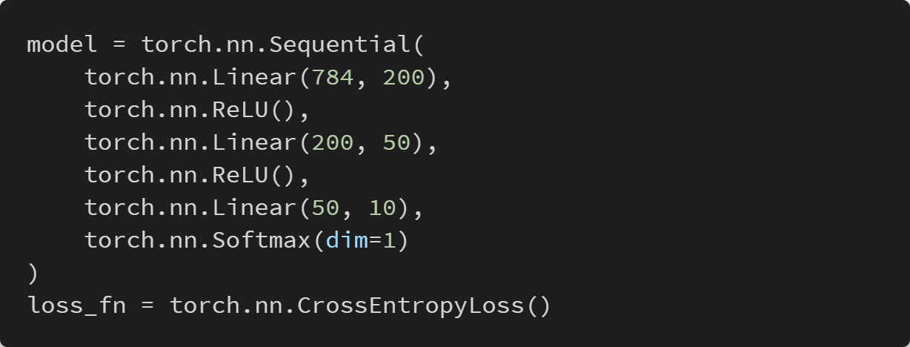
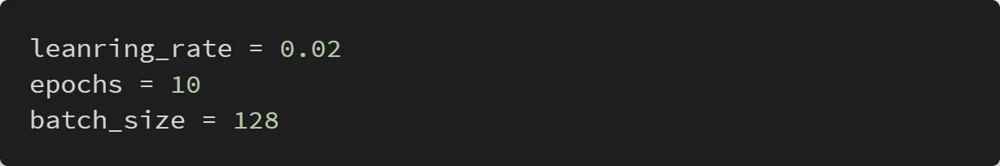
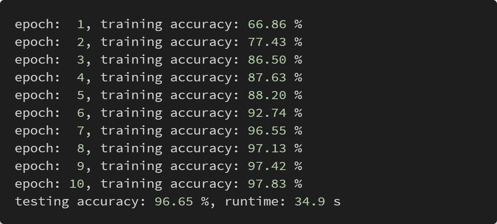

# Homework 3

###### Jin Xu, Rutgers University

## Implementation

I use **Pytorch** to implement the model.

I use the same way as HW1 to load the data(require **pickle**).

The structure of my model: 

The hyperparameters:

I use mini-batch SGD for the training, and I use a GPU(GeForce RTX 2080) to speedup .

## Result

One time:

Five times performance:

| #           |   1   |   2   |   3   |   4   |   5   | Average |
| :---------- | :---: | :---: | :---: | :---: | :---: | :-----: |
| Accuracy(%) | 96.43 | 88.00 | 97.24 | 96.91 | 96.65 |  95.05  |
| runtime(s)  | 34.7  | 35.3  | 35.2  | 35.8  | 34.9  |  35.2   |

