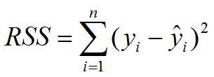

# Homework 3

###### Jin Xu

###### jx217@scarletmail.rutgers.edu

###### ECE, School of  Graduate Studies

###### Rutgers University

### Implementation

I use the polynomial curve fitting.

The $\alpha$ and $\beta$ is fixed.

In order to determine the M, I first calculate residual sum of squares(**RSS**) for N points, for $M \in [4,13]$

And then I choose the M that has minimum RSS.

And finally I use this M for curve fitting and prediction.

## Result

###### Note: my stock data are from 2019-02-21 09:30:00 to 2020-03-02 09:30:00, interval is one day

| Stock | Absolute Error | Relative Error |
| :---: | :------------: | :------------: |
| NVDA  |    12.08291    |    0.05088     |
|  AMD  |    2.192443    |    0.045352    |
| BABA  |    7.762001    |    0.035995    |
|  KO   |    0.611379    |    0.01068     |
|  DIS  |    5.674601    |    0.039255    |
| AMZN  |    56.52476    |    0.02937     |
| BILI  |    1.23648     |    0.055725    |
| NTES  |    11.22848    |    0.034946    |
| GOOG  |    38.99946    |    0.027195    |
| INTC  |    2.059722    |    0.033429    |

