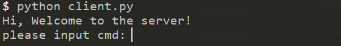
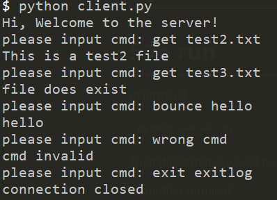
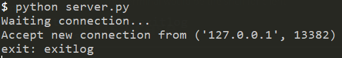

# README

###### 

## To run

In terminal:

```
python server.py
```

Then this terminal would be the output of server

In another terminal:

```
python client.py
```

Then this terminal would be the shell for client

## Use case

When open the client shell, it shows:



Just input the command and it will send to the server.

Valid commands: "get", "bounce", "exit", "GET", "BOUNCE", "EXIT".

All possible input & output:



In the server, we have:

